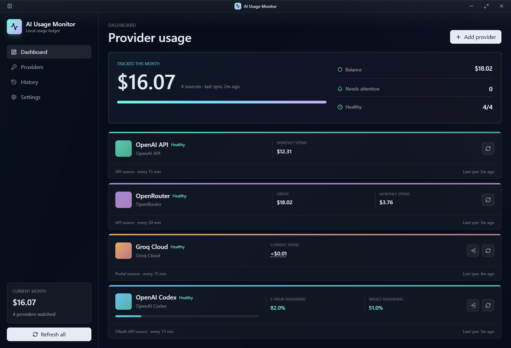

# AI Usage Monitor

Local-first desktop usage tracking for AI providers.

**NOTE**: This is 100% vibe coded to suit my needs for monitoring my AI usage across different providers.



AI Usage Monitor sits in your system tray and keeps a local ledger of spend, credits, quota, and sync health across multiple AI accounts.

## Providers

- OpenAI API: monthly spend from an OpenAI Admin API key.
- OpenRouter: credit balance and monthly spend.
- Groq Cloud: current spend from the authenticated Groq console.
- OpenAI Codex: OAuth login with 5-hour and weekly quota tracking.
- OpenCode: browser login tracking Zen credit balance, spend, and debit, plus Go 5-hour, weekly, and monthly remaining quotas.

Multiple accounts per provider are supported, so work and personal usage can stay separate.

## Privacy

- No cloud backend.
- No telemetry.
- API keys are encrypted locally with Electron `safeStorage`.
- Browser sessions are isolated per provider account.
- Usernames and passwords are not stored.

## Install

Download the latest installer from the [latest release](https://github.com/RyanTheAllmighty/ai-usage-monitor/releases/latest).

## Development

This project uses pnpm only.

```bash
pnpm install
pnpm run dev
pnpm run verify
pnpm test
pnpm run build
```

Commits are checked with Husky, lint-staged, Prettier, ESLint, and commitlint. Use conventional commit messages, for example `feat: add provider refresh queue`.

Create a GitHub release by updating `package.json`, committing to `main`, then pushing a matching version tag:

```bash
git tag v0.0.1
git push origin v0.0.1
```

You can also run the Release workflow manually with tag `v0.0.1`. The tag must match the version in `package.json`.

GitHub Actions builds Windows, macOS, and Linux artifacts and attaches them to the release.
